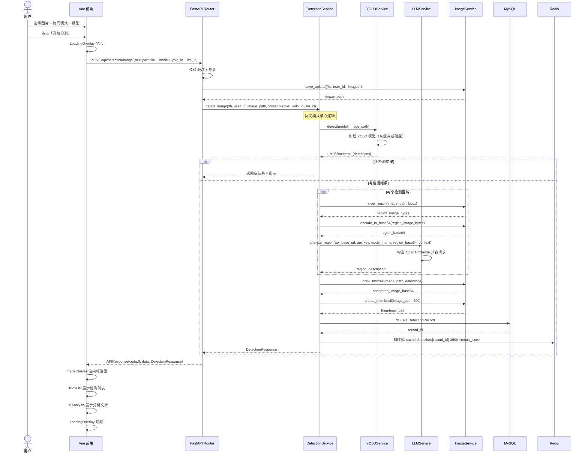
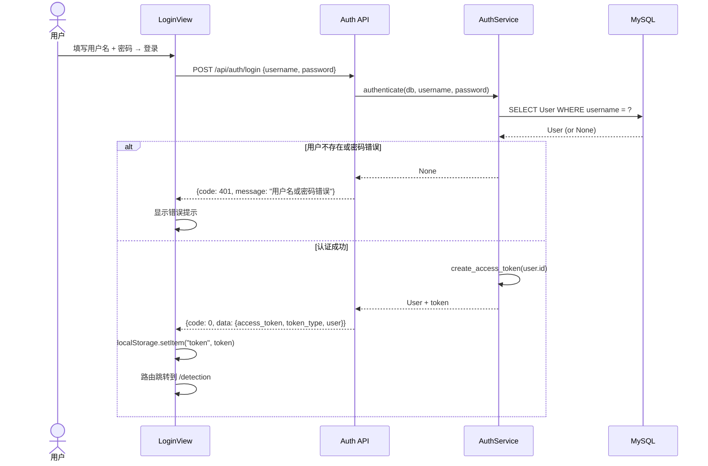
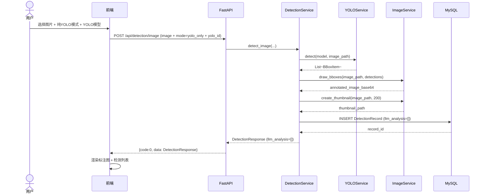
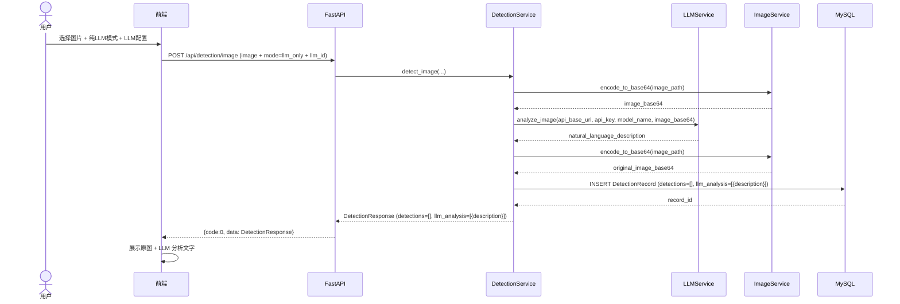
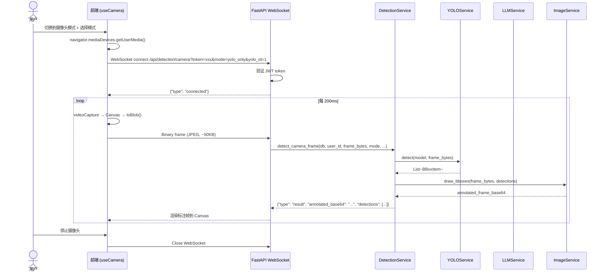
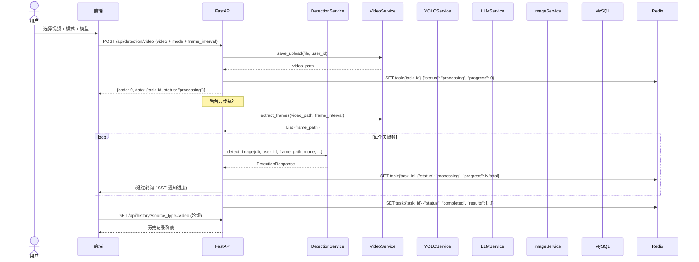
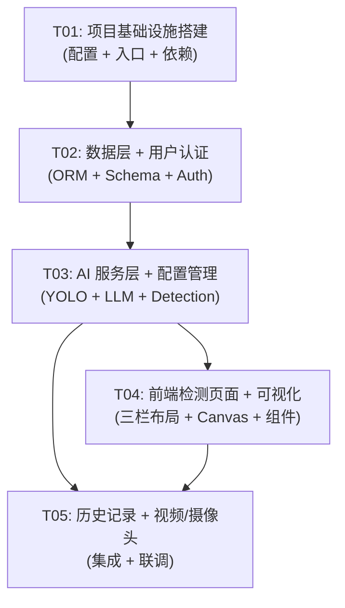

# 系统架构设计文档 —— 图像目标检测与分析平台

---

**项目**：`yolo_detection_platform`  
**作者**：Bob（架构师）  
**日期**：2025-07-14  
**依赖输入**：PRD v1.0（Alice，产品经理）+ 用户确认结果

---

## Part A：系统设计

---

### 1. 实现方案与框架选型

#### 1.1 核心技术挑战

| 挑战 | 分析 | 对策 |
|---|---|---|
| **YOLO 模型动态加载** | 内置模型 + 用户上传自定义 .pt 文件，需运行时切换 | 模型注册表模式，懒加载 + 缓存，单例管理 |
| **多模态 LLM 兼容** | 需同时兼容 OpenAI、Claude 及自定义兼容接口 | 适配器模式，统一 `BaseLLMAdapter` 抽象，按 `api_base_url` 特征自动路由 |
| **协同模式区域裁剪** | YOLO 检测后需精确裁剪目标区域发送给 LLM | PIL 裁剪 + base64 编码，逐区域异步发送，支持并发控制 |
| **大文件上传** | 视频文件 + 自定义模型（上限 200MB） | 分片上传 / 流式传输，前端进度条，后端文件校验（magic bytes） |
| **CPU 优先 GPU 可选** | 用户环境各异，需自动检测并降级 | `torch.cuda.is_available()` 检测，配置文件切换 device |
| **WebSocket 实时推流** | 摄像头帧需低延迟推送（< 500ms） | FastAPI WebSocket + 跳帧策略，前端 Canvas 渲染 |

#### 1.2 框架与库选型

| 层级 | 选型 | 版本 | 理由 |
|---|---|---|---|
| **前端框架** | Vue 3 + Composition API | ^3.4 | PRD 指定，响应式 + TS 支持好 |
| **构建工具** | Vite | ^5.0 | 快速 HMR，Vue 官方推荐 |
| **类型系统** | TypeScript | ^5.3 | 前后端类型安全 |
| **状态管理** | Pinia | ^2.1 | Vue 3 官方状态管理，模块化 |
| **UI 组件库** | Element Plus | ^2.5 | Vue 3 生态最成熟，组件丰富 |
| **CSS 框架** | Tailwind CSS | ^3.4 | 快速布局，三栏布局便捷 |
| **HTTP 客户端** | Axios | ^1.6 | 拦截器、进度回调 |
| **Canvas 渲染** | 原生 Canvas API | - | 边界框绘制，无额外依赖 |
| **后端框架** | FastAPI | ^0.110 | PRD 指定，异步原生，自动 OpenAPI |
| **ASGI 服务器** | Uvicorn | ^0.29 | FastAPI 标配 |
| **ORM** | SQLAlchemy 2.0 | ^2.0 | 异步支持，Python ORM 标准 |
| **数据库迁移** | Alembic | ^1.13 | SQLAlchemy 官方迁移工具 |
| **数据校验** | Pydantic v2 | ^2.6 | FastAPI 内置，类型安全 |
| **认证** | python-jose + passlib | ^3.3 / ^1.7 | JWT + bcrypt |
| **图像处理** | Pillow | ^10.2 | 裁剪、编码、水印 |
| **YOLO 引擎** | ultralytics | ^8.2 | YOLOv8/v10/v11 统一接口 |
| **Redis 客户端** | redis-py (async) | ^5.0 | 异步 Redis 操作 |
| **MySQL 驱动** | aiomysql | ^0.2 | SQLAlchemy 异步 MySQL |
| **文件校验** | python-magic | ^0.4 | 上传文件 magic bytes 校验 |
| **视频处理** | opencv-python-headless | ^4.9 | 跳帧提取、摄像头采集 |

#### 1.3 架构模式

```
┌──────────────────────────────────────────────────────────────┐
│                      前端 (Vue 3 SPA)                        │
│  ┌─────────┐ ┌──────────┐ ┌──────────┐ ┌────────────────┐  │
│  │  Views   │ │Components│ │  Stores  │ │  API Client    │  │
│  │ (pages)  │ │  (UI)    │ │ (Pinia)  │ │  (Axios+WS)   │  │
│  └─────────┘ └──────────┘ └──────────┘ └───────┬────────┘  │
└─────────────────────────────────────────────────┼───────────┘
                                                  │ HTTP/WS
┌─────────────────────────────────────────────────┼───────────┐
│                   后端 (FastAPI)                  │           │
│  ┌──────────────┐  ┌──────────────┐  ┌──────────┴────────┐ │
│  │  API Router  │  │   Schemas    │  │   Middleware       │ │
│  │  (REST+WS)   │  │  (Pydantic)  │  │  (Auth/CORS/Log)  │ │
│  └──────┬───────┘  └──────────────┘  └───────────────────┘ │
│         │                                                    │
│  ┌──────┴───────────────────────────────────────────────┐   │
│  │                  Service Layer                        │   │
│  │  ┌──────────┐ ┌──────────┐ ┌──────────┐ ┌─────────┐ │   │
│  │  │  Auth    │ │  YOLO    │ │   LLM    │ │Detection│ │   │
│  │  │ Service  │ │ Service  │ │ Service  │ │ Service │ │   │
│  │  └──────────┘ └────┬─────┘ └────┬─────┘ └────┬────┘ │   │
│  │                    │             │            │       │   │
│  │               ┌────┴─────────────┴────────────┴───┐  │   │
│  │               │       Image / Video Utils         │  │   │
│  │               └──────────────────────────────────┘  │   │
│  └──────────────────────┬──────────────────────────────┘   │
│                         │                                    │
│  ┌──────────────────────┴──────────────────────────────┐   │
│  │                   Data Layer                         │   │
│  │  ┌──────────┐  ┌──────────┐  ┌──────────────────┐   │   │
│  │  │  Models  │  │ Database │  │  Redis Client    │   │   │
│  │  │(SQLAlch) │  │  Session │  │  (Async Redis)   │   │   │
│  │  └──────────┘  └──────────┘  └──────────────────┘   │   │
│  └─────────────────────────────────────────────────────┘   │
└─────────────────────────────────────────────────────────────┘
                          │                │
                    ┌─────┴────┐    ┌─────┴─────┐
                    │  MySQL   │    │   Redis    │
                    └──────────┘    └───────────┘
```

**分层职责**：
- **API Router**：路由分发、参数校验、响应格式化
- **Service Layer**：核心业务逻辑，所有 AI 推理在此层
- **Data Layer**：ORM 模型 + 数据库/缓存访问

---

### 2. 文件列表

```
E:\project\YOLO\end\
├── backend/
│   ├── app/
│   │   ├── __init__.py
│   │   ├── main.py                          # FastAPI 应用入口
│   │   ├── config.py                        # 配置管理（环境变量 + .env）
│   │   ├── api/
│   │   │   ├── __init__.py
│   │   │   ├── deps.py                      # 依赖注入（get_db, get_current_user）
│   │   │   ├── auth.py                      # 注册/登录/获取当前用户
│   │   │   ├── detection.py                 # 检测接口（图片/视频/WebSocket）
│   │   │   ├── llm_config.py                # LLM API 配置 CRUD
│   │   │   ├── yolo_models.py               # 自定义 YOLO 模型管理
│   │   │   └── history.py                   # 历史记录查询
│   │   ├── models/
│   │   │   ├── __init__.py
│   │   │   ├── user.py                      # User ORM
│   │   │   ├── detection_record.py          # DetectionRecord ORM
│   │   │   ├── llm_config.py                # LLMConfig ORM
│   │   │   └── yolo_model.py                # YOLOModel ORM
│   │   ├── schemas/
│   │   │   ├── __init__.py
│   │   │   ├── auth.py                      # 注册/登录请求响应 schema
│   │   │   ├── detection.py                 # 检测请求/响应 schema
│   │   │   ├── llm_config.py                # LLM 配置 schema
│   │   │   ├── yolo_model.py                # YOLO 模型 schema
│   │   │   └── history.py                   # 历史记录 schema
│   │   ├── services/
│   │   │   ├── __init__.py
│   │   │   ├── auth_service.py              # 用户认证业务逻辑
│   │   │   ├── yolo_service.py              # YOLO 模型加载与推理
│   │   │   ├── llm_service.py               # 多模态 LLM API 调用
│   │   │   ├── detection_service.py         # 检测编排（YOLO/LLM/协同）
│   │   │   ├── image_service.py             # 图像裁剪、编码、bbox 绘制
│   │   │   └── video_service.py             # 视频跳帧提取
│   │   ├── core/
│   │   │   ├── __init__.py
│   │   │   ├── database.py                  # SQLAlchemy 异步引擎 + Session
│   │   │   ├── redis_client.py              # Redis 异步连接
│   │   │   └── security.py                  # JWT 生成/验证、密码哈希
│   │   └── utils/
│   │       ├── __init__.py
│   │       ├── file_utils.py                # 文件验证（magic bytes、大小、类型）
│   │       └── image_utils.py               # base64 编解码、bbox 绘制工具
│   ├── alembic/
│   │   ├── env.py
│   │   └── versions/
│   ├── alembic.ini
│   ├── uploads/                             # 上传文件存储根目录
│   │   ├── images/
│   │   ├── videos/
│   │   └── models/
│   └── requirements.txt
├── frontend/
│   ├── public/
│   │   └── favicon.ico
│   ├── src/
│   │   ├── main.ts                          # Vue 应用入口
│   │   ├── App.vue                          # 根组件
│   │   ├── env.d.ts                         # 环境变量类型声明
│   │   ├── router/
│   │   │   └── index.ts                     # 路由配置
│   │   ├── stores/
│   │   │   ├── auth.ts                      # 认证状态（token, user）
│   │   │   ├── detection.ts                 # 检测状态（结果, 加载中）
│   │   │   ├── config.ts                    # LLM/YOLO 配置状态
│   │   │   └── history.ts                   # 历史记录状态
│   │   ├── api/
│   │   │   ├── client.ts                    # Axios 实例 + 拦截器
│   │   │   ├── auth.ts                      # 认证 API
│   │   │   ├── detection.ts                 # 检测 API
│   │   │   ├── llm_config.ts                # LLM 配置 API
│   │   │   ├── yolo_models.ts               # YOLO 模型管理 API
│   │   │   └── history.ts                   # 历史记录 API
│   │   ├── views/
│   │   │   ├── LoginView.vue                # 登录页
│   │   │   ├── RegisterView.vue             # 注册页
│   │   │   ├── DetectionView.vue            # 检测主页面（三栏布局）
│   │   │   └── HistoryView.vue              # 历史记录页
│   │   ├── components/
│   │   │   ├── layout/
│   │   │   │   ├── AppHeader.vue            # 顶部导航栏
│   │   │   │   ├── LeftSidebar.vue          # 左侧控制面板
│   │   │   │   └── RightPanel.vue           # 右侧结果面板
│   │   │   ├── detection/
│   │   │   │   ├── ImageCanvas.vue          # 图像 Canvas（bbox 叠加渲染）
│   │   │   │   ├── BBoxList.vue             # 检测结果列表
│   │   │   │   ├── LLMAnalysis.vue          # LLM 分析文字展示
│   │   │   │   ├── ModeSelector.vue         # 工作模式选择器
│   │   │   │   └── ModelSelector.vue        # 模型下拉选择器
│   │   │   ├── config/
│   │   │   │   ├── LLMConfigDialog.vue      # LLM API 配置弹窗
│   │   │   │   └── YOLOModelUpload.vue      # 自定义模型上传
│   │   │   └── common/
│   │   │       ├── FileUploader.vue         # 通用文件上传组件
│   │   │       └── LoadingOverlay.vue        # 加载遮罩组件
│   │   ├── types/
│   │   │   ├── detection.ts                 # 检测相关类型定义
│   │   │   ├── auth.ts                      # 认证相关类型
│   │   │   ├── config.ts                    # 配置相关类型
│   │   │   └── api.ts                       # API 通用响应类型
│   │   ├── composables/
│   │   │   ├── useCamera.ts                 # 摄像头 WebSocket 管理
│   │   │   └── useFileUpload.ts             # 文件上传进度管理
│   │   └── assets/
│   │       └── styles/
│   │           └── main.css                 # Tailwind 入口 + 全局样式
│   ├── index.html
│   ├── vite.config.ts
│   ├── tsconfig.json
│   ├── tsconfig.node.json
│   ├── tailwind.config.ts
│   ├── postcss.config.js
│   └── package.json
└── docs/
    ├── PRD.md
    ├── ARCHITECTURE.md                      # 本文件
    ├── class-diagram.mermaid
    └── sequence-diagram.mermaid
```

---

### 3. 数据结构与接口

#### 3.1 类图（Mermaid classDiagram）

```mermaid
classDiagram
    direction TB

    %% ========== ORM Models ==========
    class User {
        +int id
        +str username
        +str email
        +str password_hash
        +datetime created_at
        +datetime updated_at
        +List~DetectionRecord~ records
        +List~LLMConfig~ llm_configs
        +List~YOLOModel~ yolo_models
    }

    class LLMConfig {
        +int id
        +int user_id
        +str name
        +str api_base_url
        +str api_key
        +str model_name
        +str provider
        +bool is_active
        +datetime created_at
        +datetime updated_at
    }

    class YOLOModel {
        +int id
        +int user_id
        +str name
        +str file_path
        +str model_type
        +bool is_builtin
        +int file_size
        +bool is_active
        +datetime uploaded_at
    }

    class DetectionRecord {
        +int id
        +int user_id
        +str source_type
        +str source_path
        +str mode
        +int yolo_model_id
        +int llm_config_id
        +dict result_json
        +str thumbnail_path
        +datetime created_at
    }

    User "1" -- "many" DetectionRecord
    User "1" -- "many" LLMConfig
    User "1" -- "many" YOLOModel
    DetectionRecord "many" -- "1" YOLOModel : yolo_model_id
    DetectionRecord "many" -- "1" LLMConfig : llm_config_id

    %% ========== Pydantic Schemas ==========
    class RegisterRequest {
        +str username
        +str email
        +str password
    }

    class LoginRequest {
        +str username
        +str password
    }

    class TokenResponse {
        +str access_token
        +str token_type
        +UserResponse user
    }

    class UserResponse {
        +int id
        +str username
        +str email
    }

    class LLMConfigCreate {
        +str name
        +str api_base_url
        +str api_key
        +str model_name
        +str provider
    }

    class LLMConfigResponse {
        +int id
        +str name
        +str api_base_url
        +str model_name
        +str provider
        +bool is_active
        +str created_at
    }

    class YOLOModelResponse {
        +int id
        +str name
        +str model_type
        +bool is_builtin
        +int file_size
        +bool is_active
        +str uploaded_at
    }

    class DetectionRequest {
        +str mode
        +int yolo_model_id
        +int llm_config_id
        +int frame_interval
    }

    class BBoxItem {
        +str class_name
        +float confidence
        +float x1
        +float y1
        +float x2
        +float y2
    }

    class LLMAnalysisItem {
        +int region_index
        +str class_name
        +float confidence
        +str description
    }

    class DetectionResponse {
        +int record_id
        +str mode
        +str source_type
        +str annotated_image_base64
        +List~BBoxItem~ detections
        +List~LLMAnalysisItem~ llm_analysis
        +datetime created_at
    }

    class HistoryQuery {
        +int page
        +int page_size
        +str mode
        +str source_type
        +str date_from
        +str date_to
    }

    class HistoryListResponse {
        +int total
        +int page
        +List~HistoryItem~ items
    }

    class HistoryItem {
        +int id
        +str source_type
        +str mode
        +str thumbnail_base64
        +datetime created_at
    }

    class APIResponse~T~ {
        +int code
        +str message
        +T data
    }

    %% ========== Service Classes ==========
    class AuthService {
        +async register(db, RegisterRequest) User
        +async authenticate(db, username, password) User
        +create_access_token(user_id) str
        +get_password_hash(password) str
        +verify_password(plain, hashed) bool
    }

    class YOLOService {
        -dict _model_cache
        +async load_model(model_path, device) YOLO
        +async detect(model, image_path) List~BBoxItem~
        +async unload_model(model_id) void
        +validate_model_file(file_path) bool
    }

    class LLMService {
        -dict _adapter_registry
        +register_adapter(provider, adapter) void
        +async analyze_image(api_base_url, api_key, model_name, image_base64) str
        +async analyze_region(api_base_url, api_key, model_name, region_image_base64, context) str
        +async test_connection(api_base_url, api_key, model_name) bool
    }

    class DetectionService {
        +async detect_image(db, user_id, image_path, mode, yolo_model_id, llm_config_id) DetectionResponse
        +async detect_video(db, user_id, video_path, mode, yolo_model_id, llm_config_id, frame_interval) List~DetectionResponse~
        +async detect_camera_frame(db, user_id, frame_bytes, mode, ...) DetectionResponse
        +async _yolo_only(image_path, yolo_model_id) dict
        +async _llm_only(image_path, llm_config_id) dict
        +async _collaborative(image_path, yolo_model_id, llm_config_id) dict
    }

    class ImageService {
        +async crop_region(image_path, bbox) bytes
        +async draw_bboxes(image_path, detections) str
        +async encode_to_base64(image_path_or_bytes) str
        +async save_upload(file, user_id, category) str
        +async create_thumbnail(image_path, size) str
    }

    class VideoService {
        +async extract_frames(video_path, frame_interval) List~str~
        +async save_upload(file, user_id) str
    }

    DetectionService --> YOLOService : uses
    DetectionService --> LLMService : uses
    DetectionService --> ImageService : uses
    DetectionService --> VideoService : uses
```



#### 3.2 API 接口定义

| 方法 | 路径 | 说明 | 认证 |
|---|---|---|---|
| POST | `/api/auth/register` | 用户注册 | 否 |
| POST | `/api/auth/login` | 用户登录，返回 JWT | 否 |
| GET | `/api/auth/me` | 获取当前用户信息 | 是 |
| POST | `/api/detection/image` | 图片检测（multipart） | 是 |
| POST | `/api/detection/video` | 视频检测（multipart） | 是 |
| WS | `/api/detection/camera` | 摄像头实时检测 | 是 |
| GET | `/api/llm-configs` | 获取 LLM 配置列表 | 是 |
| POST | `/api/llm-configs` | 创建 LLM 配置 | 是 |
| PUT | `/api/llm-configs/{id}` | 更新 LLM 配置 | 是 |
| DELETE | `/api/llm-configs/{id}` | 删除 LLM 配置 | 是 |
| POST | `/api/llm-configs/{id}/test` | 测试 LLM 连接 | 是 |
| GET | `/api/yolo-models` | 获取 YOLO 模型列表 | 是 |
| POST | `/api/yolo-models` | 上传自定义模型 | 是 |
| DELETE | `/api/yolo-models/{id}` | 删除自定义模型 | 是 |
| PUT | `/api/yolo-models/{id}/activate` | 激活/切换模型 | 是 |
| GET | `/api/history` | 历史记录列表（分页+筛选） | 是 |
| GET | `/api/history/{id}` | 历史记录详情 | 是 |
| DELETE | `/api/history/{id}` | 删除历史记录 | 是 |

---

### 4. 程序调用流程

#### 4.1 图片协同检测（核心流程）



#### 4.2 用户认证流程



#### 4.3 纯 YOLO 模式



#### 4.4 纯 LLM 模式



#### 4.5 摄像头实时检测（WebSocket）



#### 4.6 视频检测（异步任务）



---

### 5. 待明确事项 & 假设

| # | 事项 | 当前假设 | 影响 |
|---|---|---|---|
| A1 | YOLO 模型缓存策略 | 内存中最多同时缓存 2 个模型，LRU 淘汰 | 并发检测性能 |
| A2 | LLM API 超时时间 | 默认 60 秒，可在配置中调整 | 协同模式下可能较长 |
| A3 | 协同模式 LLM 并发数 | 最多同时发送 3 个区域请求 | API 限流、响应速度 |
| A4 | 视频检测结果存储 | 每帧独立存储为一条 DetectionRecord | 历史记录数量 |
| A5 | 图片存储路径 | `uploads/{user_id}/{timestamp}_{filename}` | 文件管理 |
| A6 | WebSocket 认证 | 连接时通过 query parameter 传递 token | 安全性 |
| A7 | 前端静态资源部署 | 开发时 Vite dev server 代理到 FastAPI | 跨域处理 |
| A8 | 默认 YOLO 模型 | 首次启动自动下载 `yolov8n.pt`（~6MB） | 首次启动耗时 |
| A9 | 数据库初始化 | Alembic 自动迁移，首次运行创建表 | 部署流程 |
| A10 | LLM 输出 JSON 结构 | `{"objects": [{"region": 0, "class": "car", "desc": "..."}]}` | 前后端契约 |

---

## Part B：任务分解

---

### 6. 依赖包列表

#### 6.1 后端 (requirements.txt)

```
fastapi==0.111.0
uvicorn[standard]==0.29.0
sqlalchemy[asyncio]==2.0.30
aiomysql==0.2.0
alembic==1.13.1
pydantic==2.7.1
pydantic-settings==2.3.0
python-jose[cryptography]==3.3.0
passlib[bcrypt]==1.7.4
python-multipart==0.0.9
redis[hiredis]==5.0.1
ultralytics==8.2.28
Pillow==10.3.0
opencv-python-headless==4.9.0.80
httpx==0.27.0
python-magic==0.4.27
aiofiles==23.2.1
```

#### 6.2 前端 (package.json)

```json
{
  "dependencies": {
    "vue": "^3.4.0",
    "vue-router": "^4.3.0",
    "pinia": "^2.1.0",
    "axios": "^1.7.0",
    "element-plus": "^2.7.0",
    "@element-plus/icons-vue": "^2.3.0"
  },
  "devDependencies": {
    "@vitejs/plugin-vue": "^5.0.0",
    "typescript": "^5.4.0",
    "vite": "^5.2.0",
    "vue-tsc": "^2.0.0",
    "tailwindcss": "^3.4.0",
    "postcss": "^8.4.0",
    "autoprefixer": "^10.4.0"
  }
}
```

---

### 7. 任务列表（共 5 个任务，按依赖排序）

---

#### T01：项目基础设施搭建

| 字段 | 内容 |
|---|---|
| **Task ID** | T01 |
| **Task Name** | 项目基础设施搭建 |
| **优先级** | P0 |
| **依赖** | 无 |

**目标**：搭建前后端项目骨架，配置所有构建工具、数据库连接、路由框架，确保前后端可启动运行。

**源文件**：

```
后端 (8 files):
  backend/requirements.txt
  backend/app/__init__.py
  backend/app/main.py
  backend/app/config.py
  backend/app/core/__init__.py
  backend/app/core/database.py
  backend/app/core/redis_client.py
  backend/app/core/security.py

前端 (12 files):
  frontend/package.json
  frontend/index.html
  frontend/vite.config.ts
  frontend/tsconfig.json
  frontend/tsconfig.node.json
  frontend/tailwind.config.ts
  frontend/postcss.config.js
  frontend/src/main.ts
  frontend/src/App.vue
  frontend/src/env.d.ts
  frontend/src/router/index.ts
  frontend/src/api/client.ts
  frontend/src/assets/styles/main.css
```

**关键实现要点**：
- FastAPI 应用挂载 CORS 中间件，允许前端开发服务器跨域
- SQLAlchemy 异步引擎配置，MySQL 连接串从 `.env` 读取
- Redis 异步客户端封装
- JWT 工具函数（`create_access_token` / `verify_token`）
- Pinia 实例化，挂载到 Vue app
- Axios 实例配置 `baseURL`、请求拦截器（注入 token）、响应拦截器（统一错误处理）
- Vue Router 路由骨架（`/login`, `/register`, `/detection`, `/history`）
- Tailwind CSS 配置 content 路径

---

#### T02：数据层 + 用户认证

| 字段 | 内容 |
|---|---|
| **Task ID** | T02 |
| **Task Name** | 数据层 + 用户认证 |
| **优先级** | P0 |
| **依赖** | T01 |

**目标**：定义所有 ORM 模型和 Pydantic schema，实现用户注册/登录/认证中间件，前后端认证流程可用。

**源文件**：

```
后端 (13 files):
  backend/app/models/__init__.py
  backend/app/models/user.py
  backend/app/models/detection_record.py
  backend/app/models/llm_config.py
  backend/app/models/yolo_model.py
  backend/app/schemas/__init__.py
  backend/app/schemas/auth.py
  backend/app/schemas/detection.py
  backend/app/schemas/llm_config.py
  backend/app/schemas/yolo_model.py
  backend/app/schemas/history.py
  backend/app/api/__init__.py
  backend/app/api/deps.py                       # get_db, get_current_user
  backend/app/api/auth.py                       # register, login, me
  backend/app/services/__init__.py
  backend/app/services/auth_service.py
  backend/alembic.ini
  backend/alembic/env.py

前端 (8 files):
  frontend/src/types/api.ts
  frontend/src/types/auth.ts
  frontend/src/types/detection.ts
  frontend/src/types/config.ts
  frontend/src/stores/auth.ts
  frontend/src/api/auth.ts
  frontend/src/views/LoginView.vue
  frontend/src/views/RegisterView.vue
```

**关键实现要点**：
- User 模型：`password_hash` 不返回给客户端（response_model 排除）
- DetectionRecord：`result_json` 使用 SQLAlchemy JSON 类型
- LLMConfig：`api_key` 存储前使用 AES 加密（或至少 base64 混淆），response 时脱敏（仅显示前后各 4 位）
- Alembic 初始迁移生成所有表
- 登录成功返回 JWT，前端存入 localStorage + Pinia store
- 路由守卫：未登录用户重定向到 `/login`

---

#### T03：AI 服务层 + 配置管理

| 字段 | 内容 |
|---|---|
| **Task ID** | T03 |
| **Task Name** | AI 服务层 + 配置管理 |
| **优先级** | P0 |
| **依赖** | T02 |

**目标**：实现 YOLO 推理服务、LLM 调用服务（适配器模式）、图片处理工具、检测编排服务、LLM/YOLO 配置的 CRUD API。

**源文件**：

```
后端 (12 files):
  backend/app/services/yolo_service.py
  backend/app/services/llm_service.py
  backend/app/services/image_service.py
  backend/app/services/detection_service.py      # 图片检测部分（不含视频）
  backend/app/services/video_service.py           # 仅 save_upload 和 extract_frames
  backend/app/api/llm_config.py
  backend/app/api/yolo_models.py
  backend/app/api/detection.py                    # POST /image + 辅助函数
  backend/app/utils/__init__.py
  backend/app/utils/file_utils.py
  backend/app/utils/image_utils.py

前端 (8 files):
  frontend/src/stores/config.ts
  frontend/src/stores/detection.ts
  frontend/src/api/llm_config.ts
  frontend/src/api/yolo_models.ts
  frontend/src/api/detection.ts
  frontend/src/components/config/LLMConfigDialog.vue
  frontend/src/components/config/YOLOModelUpload.vue
```

**关键实现要点**：
- YOLOService：模型注册表 `{"default": "yolov8n.pt", "custom_1": "uploads/models/xxx.pt"}`，懒加载 + LRU 缓存
- LLMService：`BaseLLMAdapter` 抽象类，`OpenAIAdapter` / `ClaudeAdapter` / `GenericOpenAIAdapter` 实现
- 协同模式：并发控制使用 `asyncio.Semaphore(3)`
- LLMConfig CRUD：API key 脱敏返回，测试连接接口（发送简短请求验证连通性）
- YOLOModel 上传：校验 magic bytes（PyTorch zip）、文件大小 ≤ 200MB
- ImageService：bbox 绘制使用 Pillow `ImageDraw`，返回 base64 JPEG

---

#### T04：前端检测页面 + 可视化组件

| 字段 | 内容 |
|---|---|
| **Task ID** | T04 |
| **Task Name** | 前端检测页面 + 可视化组件 |
| **优先级** | P0 |
| **依赖** | T03 |

**目标**：构建三栏检测主页面、Canvas 渲染组件、结果展示组件、文件上传组件，前端核心检测流程完整可用。

**源文件**：

```
前端 (14 files):
  frontend/src/views/DetectionView.vue              # 三栏布局容器
  frontend/src/components/layout/AppHeader.vue       # 顶部栏（logo + 设置入口 + 用户信息）
  frontend/src/components/layout/LeftSidebar.vue     # 左侧控制面板（输入源/模式/模型/按钮）
  frontend/src/components/layout/RightPanel.vue      # 右侧结果面板
  frontend/src/components/detection/ImageCanvas.vue  # Canvas 渲染（绘制+缩放+拖拽）
  frontend/src/components/detection/BBoxList.vue     # 边界框列表
  frontend/src/components/detection/LLMAnalysis.vue  # LLM 分析文字卡片
  frontend/src/components/detection/ModeSelector.vue
  frontend/src/components/detection/ModelSelector.vue
  frontend/src/components/common/FileUploader.vue    # 拖拽上传 + 进度条
  frontend/src/components/common/LoadingOverlay.vue
  frontend/src/composables/useFileUpload.ts
```

**关键实现要点**：
- 三栏布局：Tailwind `grid grid-cols-[240px_1fr_360px]`（或 flex），高度撑满视口
- ImageCanvas：Canvas 尺寸自适应容器，支持鼠标滚轮缩放、拖拽平移；bbox 绘制坐标根据缩放比例转换
- BBoxList：按置信度降序排列，点击列表项高亮对应 bbox
- 检测流程：上传 → 选择模式/模型 → 点击检测 → LoadingOverlay → 展示结果
- FileUploader：支持点击选择 + 拖拽上传，`onProgress` 回调显示进度条

---

#### T05：历史记录 + 视频/摄像头 + 最终集成

| 字段 | 内容 |
|---|---|
| **Task ID** | T05 |
| **Task Name** | 历史记录 + 视频/摄像头 + 最终集成 |
| **优先级** | P1 |
| **依赖** | T03, T04 |

**目标**：实现历史记录功能、视频检测、摄像头 WebSocket 实时检测，完成所有功能集成与联调。

**源文件**：

```
后端 (4 files，修改 + 新增):
  backend/app/api/detection.py       # 新增 POST /video + WS /camera
  backend/app/api/history.py         # 新增
  backend/app/services/detection_service.py  # 新增 detect_video + detect_camera_frame
  backend/app/services/video_service.py      # 完善 extract_frames

前端 (8 files):
  frontend/src/views/HistoryView.vue
  frontend/src/stores/history.ts
  frontend/src/api/history.ts
  frontend/src/composables/useCamera.ts
  frontend/src/types/detection.ts    # 补充 camera/video 类型
```

**关键实现要点**：
- 历史记录页：Element Plus Table + Pagination，支持按模式/类型筛选，点击行展开详情弹窗
- 视频检测：后端异步执行（`asyncio.create_task`），前端轮询进度（每 2 秒），显示进度条
- 摄像头 WebSocket：`useCamera` composable 管理连接生命周期，帧率控制在 5fps，每帧 JPEG 压缩质量 0.6
- 后端 WebSocket handler：验证 token → 循环接收帧 → 调用 detect_camera_frame → 推送结果
- 最终联调：前后端全流程测试，确保 P0 全部功能可用

---

### 8. 共享知识

以下约定贯穿所有文件，由前端和后端工程师共同遵守：

```yaml
# ============ API 通用约定 ============
api_response_format:
  description: "所有 API 响应统一使用 {code, message, data} 格式"
  success: '{ "code": 0, "message": "ok", "data": {...} }'
  error: '{ "code": <error_code>, "message": "<描述>", "data": null }'

error_codes:
  0: 成功
  401: 未认证（token 无效或过期）
  403: 无权限（只能操作自己的资源）
  404: 资源不存在
  413: 文件大小超限
  422: 参数校验失败
  500: 服务器内部错误

# ============ 认证约定 ============
auth:
  method: "JWT (Bearer Token)"
  token_location: "HTTP Header: Authorization: Bearer <token>"
  token_expiry: "24 小时"
  websocket_auth: "Query parameter: ?token=<jwt_token>"

# ============ 日期时间 ============
datetime_format: "ISO 8601 UTC (例: 2025-07-14T10:30:00Z)"
timezone: "所有时间以 UTC 存储，前端按浏览器时区显示"

# ============ 文件存储 ============
upload_path_pattern: "uploads/{category}/{user_id}/{timestamp}_{original_filename}"
allowed_image_types: ["image/jpeg", "image/png", "image/webp", "image/bmp"]
max_image_size: "20 MB"
allowed_video_types: ["video/mp4", "video/avi", "video/mov", "video/webm"]
max_video_size: "500 MB"
allowed_model_types: ["application/octet-stream", "application/zip"]  # .pt 文件
max_model_size: "200 MB (可在 config.py 中配置)"

# ============ 命名规范 ============
backend_naming:
  files: "snake_case"
  classes: "PascalCase"
  functions: "snake_case"
  database_tables: "snake_case 复数 (users, detection_records)"

frontend_naming:
  files: "PascalCase (组件) / camelCase (工具函数、composables)"
  components: "PascalCase with <template>"
  stores: "camelCase (useAuthStore, useDetectionStore)"
  api_functions: "camelCase (login, uploadImage)"

# ============ API 路径约定 ============
api_prefix: "/api"
resource_routes: "复数形式 ( /api/llm-configs, /api/yolo-models )"
action_routes: "动词 + 单数 ( /api/auth/login, /api/detection/image )"

# ============ 前端状态管理 ============
pinia_store_pattern: "Composition API style (defineStore + ref/computed)"
state_persistence: "auth token 持久化到 localStorage，其他状态不持久化"

# ============ 错误处理 ============
backend: "Service 层异常转换为 HTTPException，统一在 main.py 注册 exception_handler"
frontend: "Axios 响应拦截器统一处理 401（跳转登录）、500（Toast 提示）"

# ============ 安全约定 ============
password_hashing: "bcrypt (passlib)"
api_key_storage: "AES-256-CBC 加密存储（密钥来自环境变量）"
sql_injection: "SQLAlchemy 参数化查询（默认安全）"
xss: "Vue 默认转义（v-html 禁止用于用户输入内容）"
file_upload: "校验 magic bytes + 扩展名白名单"

# ============ 模型推理约定 ============
yolo_default_model: "yolov8n.pt（首次启动自动下载）"
yolo_device: "优先 CUDA，fallback CPU（环境变量 DEVICE 可覆盖）"
yolo_confidence_threshold: 0.25
llm_timeout: 60 秒
llm_max_retries: 2

# ============ 视频/摄像头约定 ============
video_frame_interval: 5（每 5 帧检测 1 帧，可配置）
camera_fps: 5（每秒推送 5 帧到后端）
camera_jpeg_quality: 0.6
websocket_max_frame_size: 512 KB
```

---

### 9. 任务依赖图



**说明**：
- T01 → T02：数据层依赖项目骨架和数据库连接
- T02 → T03：AI 服务层依赖 ORM 模型和用户认证
- T03 → T04：前端可视化依赖后端 API 就绪
- T03 → T05：视频/摄像头依赖 AI 服务层
- T04 → T05：历史记录页面依赖公共组件

---

*文档版本：v1.0 | 作者：Bob（架构师） | 日期：2025-07-14*
