# YOLO 检测平台 — 模块化重构架构设计

> 本文档为架构师 Bob 对模块化重构的架构设计决策记录。
> 详细实施任务表见 [MODULARIZATION_PLAN.md](./MODULARIZATION_PLAN.md)。

---

## Part A: 架构设计

### 1. 实现方法

#### 核心挑战

| 挑战 | 分析 | 策略 |
|------|------|------|
| **导入路径冗长** | `from app.services.detection_service import DetectionService` 暴露了不必要的实现细节 | 包级 `__init__.py` 重导出 + `__all__` |
| **路由层腐化** | 4 个路由文件混入 ORM 查询使端点函数臃肿且难以测试 | 补全 Service 层覆盖，路由只做薄调用 |
| **巨型模块** | `task_queue.py` 579 行混合 5 种处理逻辑，`config.py` 100 行混合 7 个领域 | 按职责拆分为独立模块 |
| **重复模式** | 手动响应构造、前端 6 视图重复布局、裸 API 调用 | 统一工具函数 + 共享组件 |

#### 架构模式

| 层级 | 模式 | 说明 |
|------|------|------|
| **路由层 (api/)** | 薄控制器 | 仅参数校验 + 依赖注入 + 调用 Service + 返回响应 |
| **Service 层 (services/)** | 领域服务 | 每个 Service 对应一个业务领域，接受 `AsyncSession` 作为构造参数 |
| **持久层 (models/)** | ORM 映射 | 仅定义表结构和关系，无业务逻辑 |
| **基础设施 (core/)** | 工具模块 | 数据库连接、Redis、安全工具，与业务无关 |
| **配置 (config/)** | 领域配置 | 按领域拆分为 7 个子模块，通过组合类统一暴露 |

#### 框架与库选择

本重构不引入新的第三方依赖。所有改造依赖标准库和已有框架：

- **后端**: Python 3.10+ 标准库 + FastAPI + SQLAlchemy 2.0
- **前端**: Vue 3 + TypeScript + Pinia + Element Plus

### 2. 目标文件结构

```
backend/app/
├── __init__.py                    # 版本号
├── main.py                        # FastAPI 入口（不变）
├── config.py                      # [兼容层] 从 app.config 重导出
├── exceptions.py                  # [新建] 自定义异常层次
├── config/
│   ├── __init__.py                # 组合所有子 Settings → settings 实例
│   ├── database.py                # MySQL 配置
│   ├── redis.py                   # Redis 配置
│   ├── auth.py                    # JWT 配置
│   ├── upload.py                  # 上传大小限制
│   ├── yolo.py                    # YOLO 模型参数
│   ├── llm.py                     # LLM 超时/重试
│   └── server.py                  # 主机/端口/CORS/环境
├── core/
│   ├── __init__.py                # [增强] 重导出 engine, get_db, redis, security
│   ├── database.py
│   ├── redis_client.py
│   └── security.py
├── api/
│   ├── __init__.py                # [增强] 重导出所有 router + get_current_user
│   ├── deps.py
│   ├── responses.py               # [新建] success_response, paginated_response, error_response
│   ├── auth.py, chat.py, dashboard.py
│   ├── detection.py, history.py, llm_config.py
│   ├── system.py, tasks.py, yolo_models.py
├── models/
│   ├── __init__.py                # [已有重导出，不变]
│   ├── user.py, llm_config.py
│   ├── yolo_model.py, detection_record.py
├── schemas/
│   ├── __init__.py                # [增强] 重导出所有 schema
│   ├── auth.py, detection.py, history.py
│   ├── llm_config.py, yolo_model.py
├── services/
│   ├── __init__.py                # [增强] 重导出所有 Service
│   ├── base.py                    # [新建] BaseService ABC
│   ├── auth_service.py
│   ├── detection_service.py
│   ├── image_service.py
│   ├── llm_service.py
│   ├── yolo_service.py
│   ├── video_service.py
│   ├── dashboard_service.py       # [新建]
│   ├── history_service.py         # [新建]
│   ├── llm_config_service.py      # [新建]
│   ├── task_queue.py              # [瘦身] 仅保留调度循环
│   └── processors/
│       ├── __init__.py            # [新建]
│       ├── image_processor.py     # [新建] 图片检测处理器
│       ├── video_processor.py     # [新建] YOLO 视频处理器
│       ├── frame_analysis_processor.py  # [新建] LLM 逐帧分析
│       └── camera_processor.py    # [新建] 摄像头处理
└── utils/
    ├── __init__.py                # [增强] 重导出
    ├── file_utils.py
    # image_utils.py → [已删除]
```

```
frontend/src/
├── api/
│   ├── client.ts
│   ├── auth.ts, detection.ts, history.ts
│   ├── llm_config.ts, yolo_models.ts
│   ├── tasks.ts                   # [新建]
│   ├── dashboard.ts               # [新建]
│   └── system.ts                  # [新建]
├── stores/
│   ├── auth.ts, config.ts, detection.ts, history.ts
│   └── task.ts                    # [新建]
├── composables/
│   ├── index.ts                   # [新建] barrel export
│   ├── useCamera.ts
│   ├── useFileUpload.ts
│   ├── useTaskList.ts             # [新建 P2]
│   └── useChat.ts                 # [新建 P2]
├── types/
│   ├── api.ts, auth.ts, config.ts, detection.ts
├── components/
│   ├── index.ts                   # [新建] 顶层 barrel
│   ├── chat/
│   │   ├── index.ts               # [新建]
│   │   └── MarkdownRenderer.vue
│   ├── common/
│   │   ├── index.ts               # [新建]
│   │   ├── FileUploader.vue
│   │   └── LoadingOverlay.vue
│   ├── config/
│   │   ├── index.ts               # [新建]
│   │   ├── LLMConfigDialog.vue
│   │   └── YOLOModelUpload.vue
│   ├── detection/
│   │   ├── index.ts               # [新建]
│   │   ├── BBoxList.vue, ImageCanvas.vue
│   │   ├── LLMAnalysis.vue, ModeSelector.vue, ModelSelector.vue
│   └── layout/
│       ├── index.ts               # [新建]
│       ├── AppHeader.vue, LeftSidebar.vue, RightPanel.vue
│       └── LayoutShell.vue        # [新建]
├── views/
│   ├── LoginView.vue, RegisterView.vue  # 无布局变更
│   ├── DashboardView.vue          # [修改] 使用 LayoutShell
│   ├── DetectionView.vue          # [修改] 使用 LayoutShell + TaskStore
│   ├── HistoryView.vue            # [修改] 使用 LayoutShell
│   ├── ModelsView.vue             # [修改] 使用 LayoutShell
│   ├── ChatView.vue               # [修改] 使用 LayoutShell + TaskStore
│   └── VideoSourceView.vue        # [修改] 使用 LayoutShell + TaskStore
└── router/index.ts
```

### 3. 数据结构与接口

```mermaid
classDiagram
    class AppException {
        +str message
        +int code
        +int status_code
    }
    class NotFoundException
    class ValidationException
    class AuthException
    class BusinessException
    class ServiceUnavailableException
    AppException <|-- NotFoundException
    AppException <|-- ValidationException
    AppException <|-- AuthException
    AppException <|-- BusinessException
    AppException <|-- ServiceUnavailableException

    class ResponseHelpers {
        +success_response(data, message) dict
        +paginated_response(items, total, page, page_size) dict
        +error_response(code, message, data) dict
    }

    class BaseService {
        +AsyncSession db
    }

    class DashboardService {
        +get_stats(user_id) dict
    }
    class HistoryService {
        +list_records(user_id, filters) dict
        +get_record(record_id) DetectionRecord
        +delete_record(record_id)
    }
    class LLMConfigService {
        +create(user_id, data) LLMConfig
        +list(user_id) list
        +update(config_id, data) LLMConfig
        +delete(config_id)
        +test_connection(config_id) dict
    }

    BaseService <|-- DashboardService
    BaseService <|-- HistoryService
    BaseService <|-- LLMConfigService

    class TaskQueue {
        -_process_loop()
        -_dispatch(db, record)
    }
    class ImageProcessor {
        +process(record)
    }
    class VideoProcessor {
        +process(record)
    }
    class FrameAnalysisProcessor {
        +process(record)
    }
    TaskQueue --> ImageProcessor
    TaskQueue --> VideoProcessor
    TaskQueue --> FrameAnalysisProcessor
```



### 4. 关键调用流程

#### 图片检测（同步）— 重构后

```
POST /api/detection/detect
  → get_current_user (验证 JWT)
  → DetectionService(db).process_image_detection(...)
    → YOLOService.detect() / LLMService.analyze_image()
    → ImageService.generate_thumbnail()
    → db.add(DetectionRecord) + db.commit()
  → success_response(data=result)
  → 200 {"code":0, "message":"ok", "data":{...}}
```

#### 视频检测（异步队列）— 重构后

```
POST /api/tasks (video upload)
  → db.add(DetectionRecord, status="pending") → commit()
  → success_response(data={task_id, status:"pending"})

[后台 TaskQueue._process_loop]
  → SELECT ... FOR UPDATE SKIP LOCKED (轮询 pending)
  → _dispatch(db, record):
    → VideoProcessor.process() 或 FrameAnalysisProcessor.process()
    → 逐帧处理 + 进度更新

GET /api/tasks/{id}
  → db 查询 → success_response(data=record)
```

#### 异常处理 — 重构后

```
raise NotFoundException("YOLO模型不存在")
  → 全局 app_exception_handler 捕获
  → 404 {"code":404, "message":"YOLO模型不存在", "data":null}
```

### 5. 不明确之处与假设

| 项 | 假设 | 依据 |
|-----|------|------|
| 循环导入风险 | `api/__init__.py` 重导出 router 可能导致 `main.py` 中的 router 注册产生循环引用 | 解决方案：`main.py` 继续使用深层导入注册 router，不在 `api/__init__.py` 重导出 router 对象（仅重导出 `get_current_user`、`responses` 等非循环项） |
| 配置多重继承 | `class Settings(DatabaseSettings, RedisSettings, ...)` 无属性名冲突 | 各领域配置前缀不同（MYSQL_、REDIS_、YOLO_ 等），已验证无冲突 |
| `image_utils.py` 死代码 | 确认无引用，可安全删除 | `grep -r "image_utils" backend/app/` 无匹配结果 |
| `_process_camera_ip/webcam` | 当前代码中 camera 任务被标记为 `"camera feature removed"` | 两个方法已无用，但仍保留在拆分后的 `camera_processor.py` 中以备将来恢复 |
| LayoutShell 右侧面板 | 部分视图需要 RightPanel（如 DetectionView），部分不需要 | LayoutShell 使用具名 slot `#right-panel` 支持可选右侧面板 |
